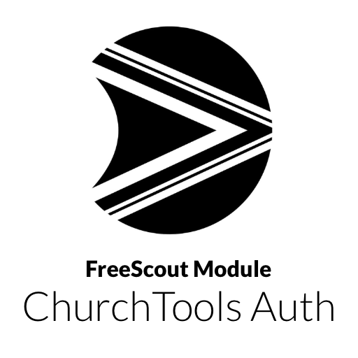

# FreeScout Module - ChurchTools Auth
Login to [FreeScout](https://github.com/freescout-helpdesk/freescout "FreeScout") with [ChurchTools](https://www.church.tools "ChurchTools") credentials and manage permissions based on group/role memberships.

## Screenshots

## Install
1. Navigate to your Modules folder e.g. `cd /var/www/html/Modules`
2. Run `git clone https://github.com/churcholution/freescout-churchtoolsauth.git ChurchToolsAuth`
3. Run `chown -R www-data:www-data ChurchToolsAuth` (or whichever user:group your webserver uses)
4. Activate the Module in the FreeScout Manage > Modules menu.

## Update
1. Navigate to the ChurchToolsAuth folder e.g. `cd /var/www/html/Modules/ChurchToolsAuth`
2. Run `git pull`
3. Run `chown -R www-data:www-data .` (or whichever user:group your webserver uses)
4. Enjoy the update!

© [Churcholution GmbH](https://www.churcholution.ch "Churcholution GmbH") | All rights reserved.